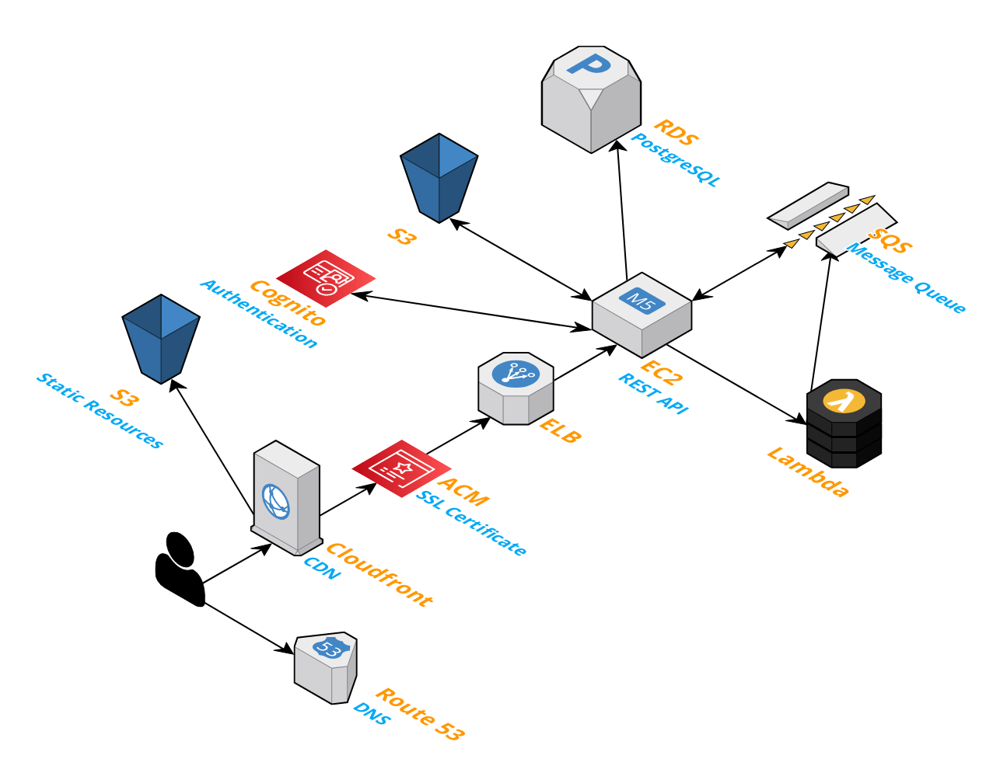

# capstone-api
## CS 467 Capstone Project - Backend API

[](https://dl.circleci.com/status-badge/redirect/gh/mike-osu/capstone-api/tree/main)

---
## Background

RESTful API for [Crowd-Sourced Travel Planner](https://eecs.oregonstate.edu/capstone/submission/pages/viewSingleProject.php?id=vEoVN87FmupNY20Q) full-stack web application

Front-end: https://github.com/shallisey/capstone-ui

Serverless compute service: https://github.com/mike-osu/location-cloud-function



---
## How to Run
#### Requirements
- [Docker](https://www.docker.com/)

1. Clone this repo
```
$ git clone ...
$ cd capstone-api
```

2. (Optional) In the [`docker-compose.yml`](https://github.com/mike-osu/capstone-api/blob/main/docker-compose.yml) file, for the `app` service, add values for the `AWS_ACCESS_KEY_ID` and `AWS_SECRET_ACCESS_KEY` environment variables

    - (User sign up and login endpoints require `AWS_ACCESS_KEY_ID` and `AWS_SECRET_ACCESS_KEY` values)
```
  app:
    ...
    environment:
      - AWS_ACCESS_KEY_ID=xxxxx
      - AWS_SECRET_ACCESS_KEY=xxxxx
```

3. Build and run the Java web and PostgreSQL database containers by executing this command:
```
$ docker-compose up -d
```

4.  Navigate to base URL 
     - http://localhost:8080
     - You should see the text "Capstone API"
     <br/>&nbsp;

5. View local Swagger API documentation
     - http://localhost:8080/swagger-ui.html
     <br/>&nbsp;

6. Stop and remove containers
```
$ docker-compose down
```